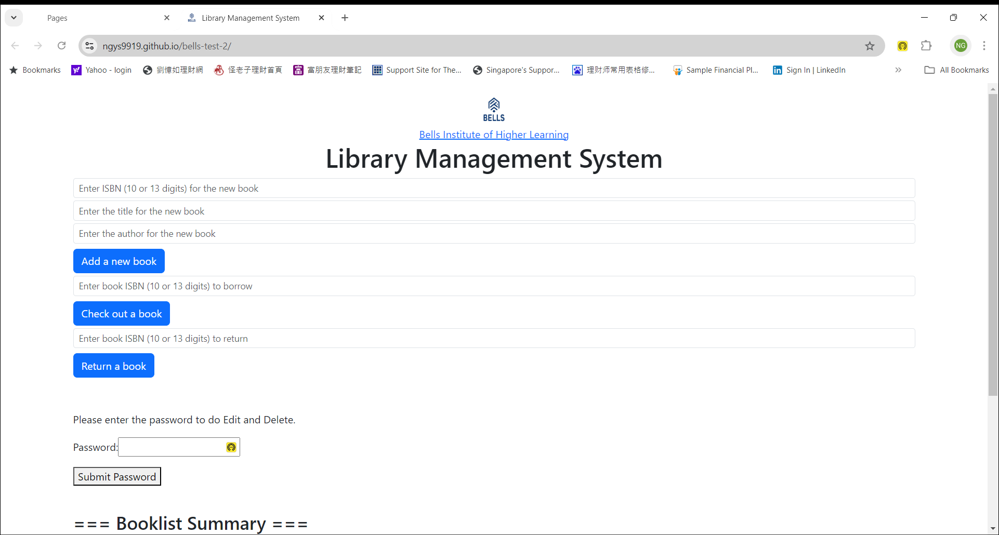

<!-- .md means markdown -->

<!-- README.md -->
<!-- This file documents the information about the portfolio project. -->
<!-- It should be READ ME first!!! -->

<!-- Heading level 1 -->
# BELLS-TEST-2
**(SCTP) Full Stack Developer**

Module 3: **Agile Front End Development with JavaScript**

***Project Assignment - Portfolio***

<!-- Heading level 3 -->
### Project File Structure:

* HTML Files (hypertext markup language)

>>> Home page (Landing Page)
: index.html

* CSS Folder (cascading style sheets)
: bootstrap.css
: style.css

* IMG Folder (images)
: bells_logo.jpg
: bellstech_logo.png
: index-1.png
: index-2.png

* RES Folder (resources)
: bells.ico

* JS Folder (javascript)
: axios.js
: script.js
: data.js

<!-- Heading level 1 -->
# Project Guide
For the purpose of the portfolio project, a landing page is created for the following:

```json
{
1. "CRUD Application" : in our case "Library Management System"
}
```

This project is about a simple *Library Management System (LMS)* at **BELLS** using the concepts we learned in the Todo List application lab. Instead of managing tasks, we'll be managing books in a library.

C = Create: adding new data to the database   
R = Read: get existing information   
U = Update: update existing information in the database   
D = Delete: remove existing information from the database

books[] -> represent our database model
- array: represents the entire database
- object: represents one record

The application of this project caters to the needs of a specific target user group, the librarian and the book lovers,
who are looking for a web-based system to track the books and its loan status.

The website provides an one-stop entry point to the library books available and its borrowed status, namely:

***
1. *ISBN*
2. *Title*
3. *Author*
4. *isCheckedOut*
***

This simple website has a Bells logo and is a single-page application for Library Management System in the landing page.\
It provides Add a new book, Check-out a book and Return a book functionalities for general user and\
password-enabled features for Edit and Delete functionalities to the librarian staff.\
It also has a Booklist Summary for the books collection in the system with ISBN (10 or 13 digits),\
Title, Author and its Checked-Out status.




The website is deployed using [GitHub Pages][1] so that it is available via a public web address.

<!-- Heading level 4 -->
#### The url for the portfolio project is here:

- [Library Management System](https://ngys9919.github.io/bells-test-2/ "My project-website!")
: Click the hyperlink <https://ngys9919.github.io/bells-test-2/>

<!-- Heading level 4 -->
#### The source codes is hosted as public on a Github repository and the link is as follows: 

- [Source Codes Github Link](https://www.github.com/ngys9919/bells-test-2 "My source-codes!")
: Click the hyperlink <https://www.github.com/ngys9919/bells-test-2>

<!-- Heading level 2 -->
## Features

<!-- Heading level 3 -->
### Existing Features

Home page:
1. Add a new book - to add a new book into the library management system with inputs like ISBN, Title and Author
2. Check-out a book - to borrow a book with input like ISBN
3. Return a book - to return a book with input like ISBN
4. Booklist Summary - to list the books collection in the library management system with information like ISBN, Title, Author and its Checked-Out status
5. Password input and Submit Password button - to enable password-protected features like Edit and Delete the book in the library management system
6. Edit - to edit the Title and Author of the book
7. Delete - to delete the book in the library management system
8. Database Storage - the books collection in the library management system is permanently stored with JSONBIN 

<!-- Heading level 3 -->
### Future Implementation
The web design could expand to include new inputs like Call Number, Publisher, Publication Year and the image of its book cover and new features like search by title or author in the library management system. It could also implement a "late return" feature that calculates fines for overdue books as well as provision for other book formats like e-book (pdf, mobi, epub), besides the physical book, with barcode scanning facility to check-out book.

<!-- Heading level 2 -->
## Testing
1. Using HTML Validator   
   The html files are checked with W3C Markup Validation Service for any errors through Validate by File Upload method.

   https://validator.w3.org/#validate_by_upload

2. Using CSS Validator   
   The css files are checked with W3C CSS Validation Service for any errors via By file upload method.

   https://jigsaw.w3.org/css-validator/#validate_by_upload

3. Using Test-Cases\
   3.1 Adding several books to the library\
   3.2 Displaying all books\
   3.3 Checking out a book\
   3.4 Trying to check out an already checked-out book\
   3.5 Returning a book\
   3.6 Displaying all books again to verify the changes\
   3.7 Test to handle potential errors, such as trying to check out or return a non-existent book\
   3.8 Test for input validation to ensure that ISBNs are unique and in the correct format    

4. Actual Usage   
   4.1 The url is activated in real use-case for laptop (Acer notebook) via browser (Google Chrome).   
   4.2 The url is activated in real use-cases (portrait and auto-rotate) for mobile (Samsung Galaxy smartphone) via browser and short-cut.

<!-- Heading level 2 -->
## Credits

### Acknowledgements
Thanks to Bells for support!

<!-- Heading level 2 -->
## About
> This project work, part of **Module 3: Agile Front End Development with JavaScript**, 
> is an individual assessment done by Candidate’s Name (as in NRIC): **Ng Yew Seng** (Candidate’s NRIC: **S XXXX 3 5 3 / F**), 
> a trainee under the **(SCTP) Full Stack Developer** course, organized by **Bells Institute of Higher Learning**. 

>>
>> Coder: ***Ng Yew Seng***\
>> © Copyright 2024\
>> Bells Institute of Higher Learning


<!-- Heading level 2 -->
## Technologies Used
- [x] HTML5
- [x] CSS3
- [x] Bootstrap (v5.3.3) 
- [x] JavaScript for interactivity
- [x] Axios (v1.7.2) for asynchronous functions
- [x] JSONBIN (v3) for data storage

<!-- Heading level 2 -->
## References
1.  [Microsoft Visual Studio Code](https://code.visualstudio.com)

2.  [Microsoft GitHub](https://www.github.com)

3.  [Axios](https://axios-http.com/docs/intro)

4.  [JSONBIN](https://jsonbin.io/)

5.  [Bells Institute of Higher Learning](https://bells.sg)

<!-- hyperlinks -->
[1]: https://github.com "GitHub"